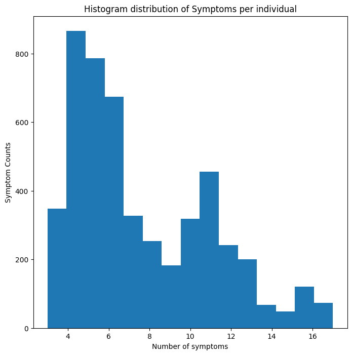
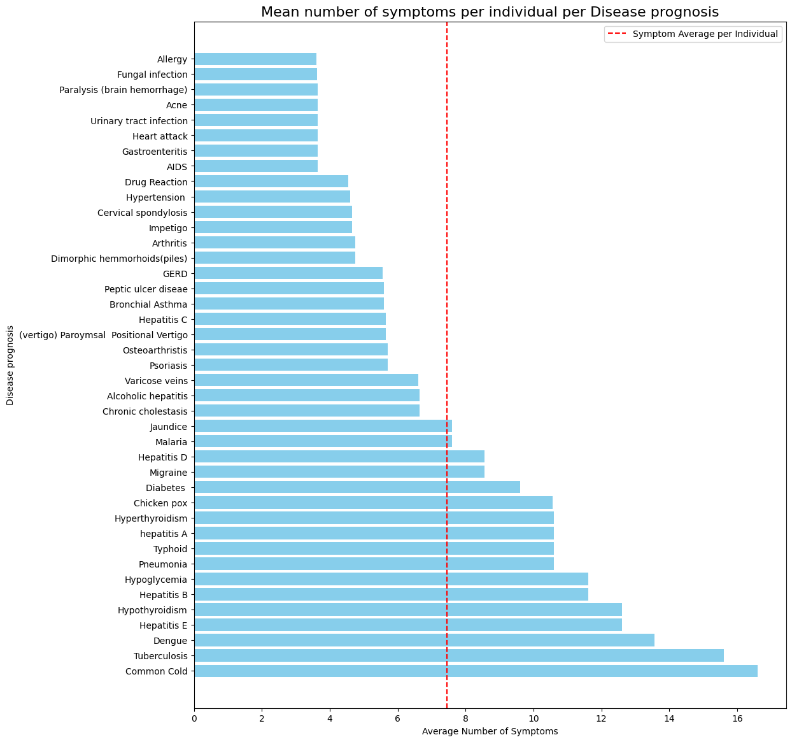
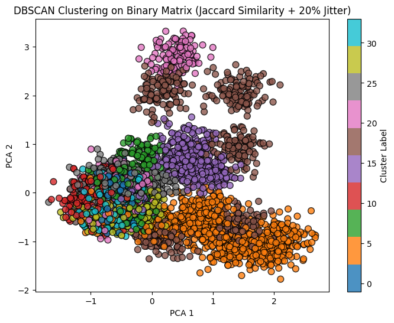
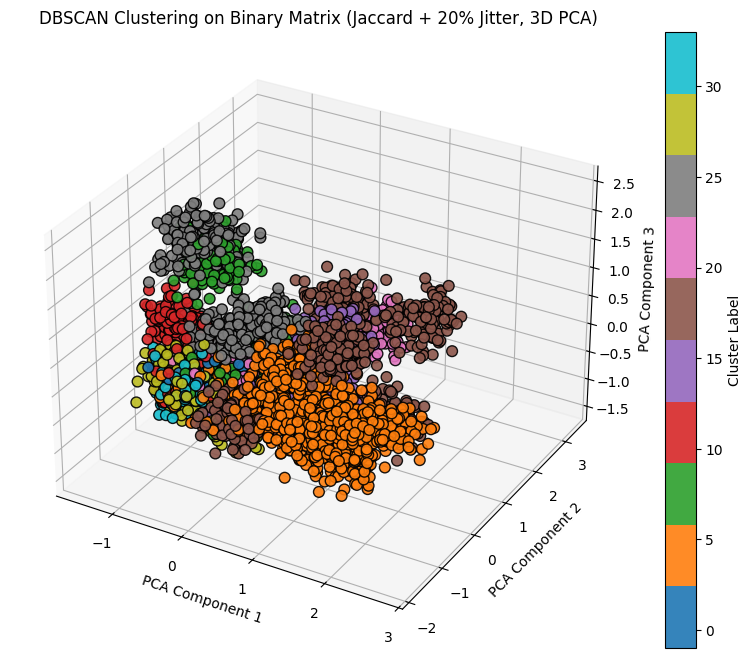
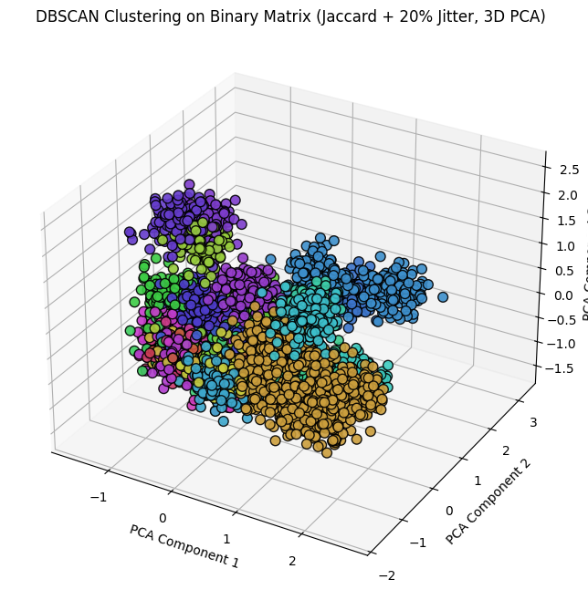
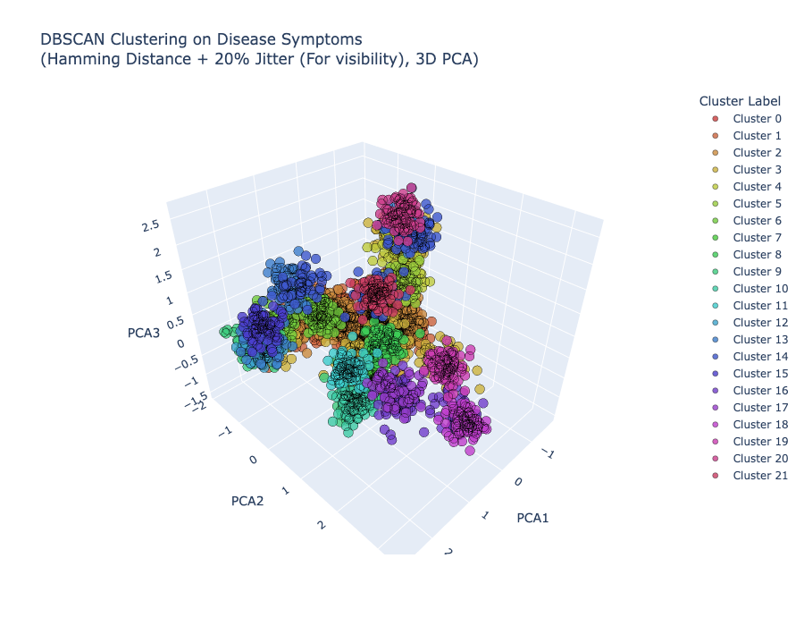
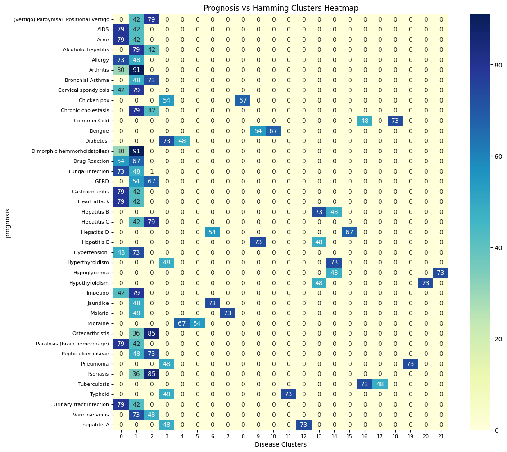
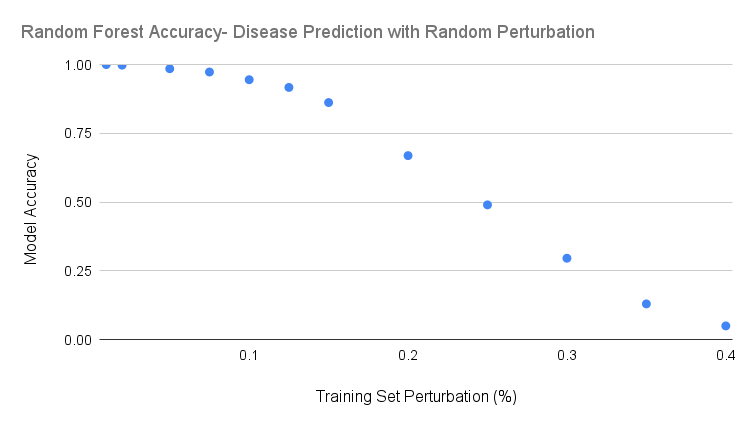

# Symptom-Based Diagnostic Decision Support AI System (DDSAS)

A machine learning project predicting the likelihood of chronic diseases based on patient symptoms and health metrics. This end-to-end system demonstrates MLOps principles, with data preprocessing, model training, MLflow experiment tracking, and a local Streamlit UI demo.  

It provides a **data-driven decision support tool** for healthcare settings.

---

# Business Objective

The **DiseaseFeatureClassifiers** delivers significant value to all stakeholders in the healthcare ecosystem. By leveraging **AI-driven symptom analysis**, the system **increases diagnostic precision and productivity**, reducing the cognitive and administrative burden on **frontline healthcare professionals**. It **improves patient outcomes** through timely and accurate risk assessment, while offering a **suggestive approach to reduce operational costs** for clinics and hospitals by optimizing workflows and minimizing unnecessary tests or interventions. Additionally, the tool helps **free up critical resources**, including emergency room capacity, enabling healthcare institutions to focus on patients with the most urgent needs, thereby enhancing **overall efficiency and cost-effectiveness**.


---

## 🎯 Stakeholders

The stakeholders of DDSAS include:

- **Physicians & Healthcare Providers:** Aid in disease diagnosis, improve accuracy, and reduce errors.  
- **Patients:** Benefit from timely and accurate diagnosis for better health outcomes.  
- **Healthcare Institutions & Clinics:** Improve workflows, standardize care, and reduce operational costs.  
- **Health IT & Data Scientists:** Build, track, and maintain ML models efficiently.  
- **Regulatory Bodies:** Ensure compliance with safety, ethics, and medical standards.  
- **Insurance Companies:** Optimize cost-effectiveness by minimizing misdiagnosis.  
- **Medical Educators & Researchers:** Train professionals and advance diagnostic methods.  
- **Patients’ Families & Caregivers:** Indirectly benefit from improved care decisions.  

This project helps all stakeholders make **informed, timely decisions** in healthcare.

## Clinical Risks

It is important to note that DDSAS is designed as a diagnostic support tool intended to assist front-line healthcare professionals. Patient well-being is central to our approach; the system is not meant to deliver definitive diagnoses based solely on symptom patterns. Instead, it aims to support nurses, physicians, and telehealth providers by offering data-driven predictions that complement their clinical expertise.

Rather than presenting a conclusive prognosis, the tool provides probabilistic estimates of potential diseases based on reported symptoms, helping guide clinicians toward more informed decisions and appropriate next steps in patient care.


## 🧩 Folder Structure

```
DiseaseFeatureClassifiers/
├── Dockerfile # Dockerfile to containerize backend
├── README.md
├── docker-compose.linux.yaml
├── docker-compose.mac.yaml
│
├── configs/ #MLFlow Config files
│   └── ...configuration files...
│
├── data/
│   ├── Testing.csv
│   ├── Training.csv
│   ├── improved_disease_dataset.csv
│   ├── cleaned_dataset/
│   └── raw_data/
│
├── images/
│   └── ...project images, plots, diagrams...
│
├── Preprocessing_EDA/
│   └── ...Contains our decided models notebooks, training and evaluations...
│
├── src/
│   ├── api/ # This directory contains the backend service that exposes the machine learning model through a REST API.
│   │   ├── inference.py
│   │   ├── main.py
│   │   ├── requirements.txt
│   │   └── schemas.py
│   │
│   ├── features/
│   │   └── ...feature engineering code...
│   │
│   │
│   ├── models_operations/
│   │   └── ...script for training models, and hosting to MLFLow...
│   │
│   ├── Experiments_JunaidKhan/
│   │   └── ...experimental notebooks/code...
│   │
│   ├── Experiments_NO/
│   │   └── ...experimental notebooks/code...
│   │
│   └── R&D/
│       └── ...experimental notebooks/code...
│
├── streamlit_app/ #This directory contains the Streamlit-based frontend application that users interact with
│   ├── Dockerfile
│   ├── main.py
│   └── requirements.txt

```
---
## Dataset
The dataset selected for this task is “Disease Prediction Using Machine Learning” (Kaggle link). It was chosen because it includes a large number of symptoms (features) and corresponding prognoses (target classes). Given its size and structure, the dataset is well-suited for this project, as it reflects the scale of real-world healthcare data, where hospitals manage large patient populations and numerous clinical variables. This allows us to test whether our model can effectively handle datasets of comparable complexity.

The dataset is already divided into training and testing subsets. In total, it contains data from 4,962 individuals with 133 possible symptoms and 42 diagnosed diseases. However, there is no accompanying metadata, so additional information such as patient demographics or age distributions cannot be analyzed.


## 🤝 Team Members

[Junaid Khan](https://www.linkedin.com/in/junaid-devops)• 
[Adam Healey](https://www.linkedin.com/in/adam-healey) • 
[Ali Hyder](https://www.linkedin.com/in/ali-hyder-iith1041) • 
[Olga Nazarenko](https://www.linkedin.com/in/olga-nazarenko0) • 
[Pradeep Venkatesan](https://www.linkedin.com/in/pradeep-venkatesan-tech/)

---

## Video Reflections
[Adam Healey](https://drive.google.com/file/d/1W6yHmcD_tL3kjgfHdAr_pbDP1bnJ-V6x/view?usp=sharing)


## 📦 Technologies Used

| Component           | Technology       | Purpose                        |
|--------------------|----------------|--------------------------------|
| Data Preprocessing       | pandas, numpy   | Clean & prepare dataset        |
| Visualization         | Matplotlib, seaborn, plotly | Visual data summaries  |
|Exploratory Data Analysis | DBScan, PCA    | Dimensionality reduction and clustering | 
| Machine Learning    | scikit-learn, xgboost | Train predictive models   |
| Experiment Tracking | MLflow          | Log experiments & model metrics|
| Packaging/Containerization | Docker          | Package app + dependencies into reproducible images for deployment|
| Model Servings/API | FastAPI          | Serve the ML model via REST API endpoints for real-time predictions|
| UI / Demo           | Streamlit       | Provide a user-friendly web UI for interacting with the model  |
---

## Sample Classification Models to Try

| Model                  | Description                                   | Assigned To         |
|------------------------|-----------------------------------------------|------------------|
| Logistic Regression    | Baseline probabilistic classifier             |    AH  |
| Random Forest          | Ensemble of decision trees, robust to overfitting |        ALH|
| XGBoost                | Gradient boosting, effective on tabular data | ON        |
| LightGBM               | Fast gradient boosting, handles large data   |   JK |
| SVM                    | Good for high-dimensional, complex boundaries | PV |
| Neural Networks (MLP)  | Deep learning for complex feature interactions |       |

---

## Sample Clustering Models to Try

| Model                  | Description                                   | Assigned To       |
|------------------------|-----------------------------------------------|----------------|
| KMeans                 | Partition-based clustering                     |   ON  |
| DBSCAN                 | Density-based, finds arbitrarily shaped clusters |      ALH|
| Agglomerative          | Hierarchical clustering                        | PV |

## Pre-processing
It is important to note that while the open-source dataset has already been split into a training and testing components, inspection of the sizes of these dataframes shows that the testing dataset represents only 1% of the training set, which according to data science and model training best practices is inadequate.  To remedy this issue, we opted to recombine the training and testing dataset to create new training/test dataframes using a 80/20% split of patients.
```
# Basic library imports
import numpy as np
import pandas as pd
import matplotlib.pyplot as plt
import seaborn as sns

# 1. Load the training data
df = pd.read_csv("/data/Training.csv")
print("Dataset shape:", df.shape)
df.head()

# 2. Load the testing data
df2 = pd.read_csv("/data/Testing.csv")
print("Dataset shape:", df2.shape)
df2.head()
```
```
#look at column names and look to see which is different between the test and training set

#save the column names of each dataframe to a set
colSet1 = set(df.columns.tolist())
colSet2 = set(df2.columns.tolist())

#use set intersection to find which columns are not in both datasets
diff = colSet1 - colSet2
print(diff)
```
The training dataset has an extra column called 'Unnamed: 133' that is not in the test set.  This column should be removed before merging

```
df = df.drop(columns=['Unnamed: 133'])

#re-check to ensure both dataframes have the same columns
colSet1 = set(df.columns.tolist())
colSet2 = set(df2.columns.tolist())
diff = colSet1 - colSet2
print(diff)

#check reverse as well:
diff2 = colSet1 - colSet2
print(diff2)
```
Columns match.  Dataframes are ready to be merged.
```
#Use pandas concatenate to combine rows of each dataset.
#also, check first to make sure the columns are in the same order in both datasets.

mergedDF = pd.concat([df, df2[df.columns]], # this ensures the correct ordering by calling df colummns first
                     ignore_index=True)
mergedDF.shape
```

## Exploratory Data Analysis (EDA)
Now that we have our newly combined dataset, exploratory analysis can begin.

Questions to explore in the dataset:
1. How clean is the dataset?  Are there any missing values or symptoms that are never reported?

2. What is the distribution of symptoms among individuals? 

3. How many symptoms in total are present? How do symptoms cluster with one another?

4. Are there individuals with identical symptom patterns?
```
#Question 1- how clean is the dataset?
#first, the prognosis column should be removed as it is a predictor, not a feature
featuresDF = mergedDF.drop(columns=['prognosis'])
# are there NAs (missing or invalid data)?
na_cols = featuresDF.columns[featuresDF.isna().any()] #get the names of the columns containing NAs
print("Columns with NaNs:", na_cols.tolist())

#checking for symptoms that are never observed among individuals
zero_sum_cols = featuresDF.columns[featuresDF.sum() == 0]

print("Columns with sum = 0:", list(zero_sum_cols))
```
"Fluid_overload" is never observed as a symptom among patients.  Prior to building a model, this syptom should be removed.

There are no NA values in the dataset.

```
#Question 2: what is the distribution of symptoms among individuals?
#This is a binary matrix with no missing values so you can simply count the number of 1s per row and calculate the mean
avgSymptoms = featuresDF.sum(axis=1).mean()
avgSymptoms
```
The average number of symptoms per patient is: 7.4.  
Next, use a histogram to inspect the distribution of symptoms among individuals.

```
plt.figure(figsize=(8,8))
plt.grid(False)
plt.hist(featuresDF.sum(axis=1), 
         bins = 15)
plt.title("Histogram distribution of Symptoms per individual")
plt.xlabel("Number of symptoms")
plt.ylabel("Symptom Counts")
```


Rather than looking at the entire dataset, we can also inspect the average number of symptoms per prognosis using `df.groupby`

```
#what is the average number of symptoms per prognosis?
avg_PrognosisCount = mergedDF.groupby('prognosis').apply( #groupby the prognosis predictor
    lambda x: x.select_dtypes(include='number').sum(axis=1).mean() #sum and average the binary count of ones in numeric columns
).reset_index(name='avg_symptomCount_perPrognosis') # name the new column of interest

print(avg_PrognosisCount)
```
Simplest way to summarize is to show as a horizontal barchart
```
#first, sort the data so its easier to read.
avg_PrognosisCount = avg_PrognosisCount.sort_values('avg_symptomCount_perPrognosis', ascending=False)

#set the size of the plot and turn off the background grid
plt.figure(figsize=(12,14))
plt.grid(False)

#Generate a horizontal barchart of average number of symptoms by prognosis
plt.barh(avg_PrognosisCount['prognosis'], avg_PrognosisCount['avg_symptomCount_perPrognosis'], color='skyblue')
#add a vertical line to show the average number of symptoms per individual
plt.axvline(x=avgSymptoms, color='red', linestyle='--', label='Symptom Average per Individual')

#Format the chart
plt.yticks(fontsize=10)
plt.ylabel('Disease prognosis')
plt.xlabel('Average Number of Symptoms')
plt.title('Mean number of symptoms per individual per Disease prognosis', fontsize = 16)

#add legend and visualize
plt.legend()
plt.show()
```


Question 3- How are symptoms related to one another?
```

#Lets cluster the features matrix and visualize
X = featuresDF

#import clustering libraries
from sklearn.cluster import DBSCAN
from sklearn.metrics import pairwise_distances
from sklearn.decomposition import PCA
import matplotlib.pyplot as plt

# Compute Jaccard distance among individuals
jaccard_dist = pairwise_distances(X.to_numpy(), metric='jaccard')

#Perform DBSCAN clusters and extract cluster labels
db = DBSCAN(metric='precomputed', eps=0.5, min_samples=5)
labels = db.fit_predict(jaccard_dist)

# The reduce the total number of dimensions down to two.
pca = PCA(n_components=2)
X_2d = pca.fit_transform(X)
```
To make points on the PCA scatter plot easier to read, each point will be randomly 'jittered' by 20% to spread out their positions.
```
jitter_strength = 0.2  # 20% jitter
jitter = np.random.normal(scale=jitter_strength, size=X_2d.shape)
X_2d_jittered = X_2d + jitter

# Visualize clusters ---
plt.figure(figsize=(8, 6))
scatter = plt.scatter(
    X_2d_jittered[:, 0],
    X_2d_jittered[:, 1],
    c=labels,
    cmap='tab10',
    s=60,
    alpha=0.8,
    edgecolor='k'
)
plt.title("DBSCAN Clustering on Binary Matrix (Jaccard Similarity + 20% Jitter)")
plt.xlabel("PCA 1")
plt.ylabel("PCA 2")
plt.colorbar(scatter, label="Cluster Label")
plt.show()
```


Looks good, but can be improved by looking at 3-dimensions instead of two.

```
#import
from mpl_toolkits.mplot3d import Axes3D
jaccard_dist = pairwise_distances(X.to_numpy(), metric='jaccard')

#Get clusters and labels
db = DBSCAN(metric='precomputed', eps=0.5, min_samples=5)
labels = db.fit_predict(jaccard_dist)

# Do PCA in 3 dimensions
pca = PCA(n_components=3)
X_3d = pca.fit_transform(X)

# Jitter the datapoints
jitter_strength = 0.2
jitter = np.random.normal(scale=jitter_strength, size=X_3d.shape)
X_3d_jittered = X_3d + jitter

# generate a 3D scatterplot
fig = plt.figure(figsize=(10, 8))
ax = fig.add_subplot(111, projection='3d')

scatter = ax.scatter(
    X_3d_jittered[:, 0],
    X_3d_jittered[:, 1],
    X_3d_jittered[:, 2],
    c=labels,
    cmap='tab10',
    s=60,
    alpha=0.9,
    edgecolor='k'
)

ax.set_title("DBSCAN Clustering on Binary Matrix (Jaccard + 20% Jitter, 3D PCA)")
ax.set_xlabel("PCA 1")
ax.set_ylabel("PCA 2")
ax.set_zlabel("PCA 3")

# Add legend and colorbar
plt.colorbar(scatter, ax=ax, label="Cluster Label")
plt.show()
```


3D Representation improves visualization, but there are more clusters than their are categorical colors to represent them.  

Next we will use a custom function to generate as many colors as there are clusters.


```
import plotly.graph_objects as go
import matplotlib.colors as mcolors


def generate_color_dict(categories):
    """
    Generate a color dictionary for a list of categories.
    Returns hex colors.
    """
    n = len(categories)
    color_dict = {}
    
    for i, cat in enumerate(categories):
        # Evenly rotate hue around the HSL color wheel
        hue = (i * 360 / n) % 360
        rgb = mcolors.hsv_to_rgb((hue/360, 0.7, 0.8))  # saturation=0.7, lightness=0.8
        color_dict[cat] = mcolors.to_hex(rgb)
    
    return color_dict
```
Plot using the improved color mapping.

```
jaccard_dist = pairwise_distances(X.to_numpy(), metric='jaccard')

#Get clusters and labels
db = DBSCAN(metric='precomputed', eps=0.5, min_samples=5)
labels = db.fit_predict(jaccard_dist)

#generate new colors
unique_labels = np.unique(labels)
print(unique_labels)
color_dict = generate_color_dict(unique_labels)
# Map each label to its corresponding color
colors = [color_dict[label] for label in labels]


# Do PCA in 3 dimensions
pca = PCA(n_components=3)
X_3d = pca.fit_transform(X)

# Jitter the datapoints
jitter_strength = 0.2
jitter = np.random.normal(scale=jitter_strength, size=X_3d.shape)
X_3d_jittered = X_3d + jitter

# generate a 3D scatterplot
fig = plt.figure(figsize=(10, 8))
ax = fig.add_subplot(111, projection='3d')

scatter = ax.scatter(
    X_3d_jittered[:, 0],
    X_3d_jittered[:, 1],
    X_3d_jittered[:, 2],
    c=colors,
    s=60,
    alpha=0.9,
    edgecolor='k'
)

ax.set_title("DBSCAN Clustering on Binary Matrix (Jaccard + 20% Jitter, 3D PCA)")
ax.set_xlabel("PCA Component 1")
ax.set_ylabel("PCA Component 2")
ax.set_zlabel("PCA Component 3")

# # Optional - Add legend and colorbar- Too many for this particular example.
# for label in unique_labels:
#     ax.scatter([], [], [], c=color_dict[label], label=f"Cluster {label}")
# ax.legend(title="Cluster Labels")


plt.show()
```


Much better, but would be even more useful if the entire plot can be rotated and interactive with each point labeled with the patient's prognosis.

```
import plotly.graph_objects as go
import matplotlib.colors as mcolors


# Compute distance- try hamming distance this time
hamming_dist = pairwise_distances(X.to_numpy(), metric='hamming')

# Run DBSCAN clustering
db = DBSCAN(metric='hamming', eps=0.55, min_samples=5)
labels = db.fit_predict(hamming_dist)

# Generate 3D PCA
pca = PCA(n_components=3)
X_3d = pca.fit_transform(X)

# Add jitter to positions
jitter_strength = 0.2
jitter = np.random.normal(scale=jitter_strength, size=X_3d.shape)
X_3d_jittered = X_3d + jitter

# Build color dictionary for clusters 
unique_labels = np.unique(labels)
color_dict = generate_color_dict(unique_labels)

# Generate interactive 3D scatter plot 
fig = go.Figure()

for label in unique_labels:
    mask = labels == label
    cluster_name = f"Cluster {label}" if label != -1 else "Noise"
    fig.add_trace(go.Scatter3d(
        x=X_3d_jittered[mask, 0],
        y=X_3d_jittered[mask, 1],
        z=X_3d_jittered[mask, 2],
        mode='markers',
        marker=dict(
            size=6,
            color=color_dict[label],
            line=dict(width=0.5, color='black'),
            opacity=0.8
        ),
        name=cluster_name,
        hovertext=mergedDF['prognosis'].iloc[mask].tolist()
    ))

# Customize layout of the plot 
fig.update_layout(
    title="DBSCAN Clustering on Disease Symptoms<br>(Hamming Distance + 20% Jitter (For visibility), 3D PCA)",
    scene=dict(
        xaxis_title='PCA1',
        yaxis_title='PCA2',
        zaxis_title='PCA3'
    ),
    legend_title="Cluster Label",
    width=900,
    height=700,
)

fig.show()
#Alternatively, this plot can be saved as an html for exploration.
##fig.write_html("dbscan_disease_clusters.html", auto_open=False)

```


Inspection of the symptom clusters makes intuitive sense.  For example, tuberculosis clusters near the common cold, and diseases of the liver (hepatitis, etc.) cluster together as well.  


Let's inspect disease clusters relative to their prognosis using `pd.crosstab` and `seaborn heatmap`:


```
table = pd.crosstab(mergedDF['prognosis'].astype(str), labels )

plt.figure(figsize=(12,12))
#sns.heatmap(table, annot=True, fmt='d', cmap='YlGnBu')

# Make y-axis labels smaller
plt.yticks(fontsize=8)  # adjust number as needed
plt.xticks(fontsize=8)  # optional: shrink x labels too


# Plot heatmap
sns.heatmap(table, annot=True, fmt='d', cmap='YlGnBu')
plt.title('Prognosis vs Disease Clusters Heatmap')
plt.xlabel("Disease Clusters")
plt.yticks(fontsize=8)  # adjust number as needed
plt.xticks(fontsize=8)  # optional: shrink x labels too

plt.show()
```


Plot shows that some disease clusters are well-defined, but others are lumped together in clusters 0 and 1.

Question 4- are there individuals (rows) with identical symptom patterns?
```
# Find duplicate rows (identical across all columns)
duplicate_rows = featuresDF[featuresDF.duplicated(keep=False)]

print(f" Number of individuals with shared symptoms: {duplicate_rows.shape[0]}")
print(f" Percentage of individuals with shared symptoms in dataset: {duplicate_rows.shape[0]/featuresDF.shape[0]}")
```
 Number of individuals with shared symptoms: 4961
 Percentage of individuals with shared symptoms in dataset: 0.9997984683595325

 Virtually every patient has identical symptoms with another individual. What is the extent of this?

 ```
#Generate a new columm that groups together individuals with identical symptoms:

mergedDF['SymptomGroup'] = pd.factorize([tuple(row) for row in mergedDF.values])[0] + 1  # add 1 to start groups from 1

#how many unique symptom groups are there?
mergedDF['SymptomGroup'].nunique()

#what is the average number of individuals with identical shared symptoms?
mergedDF['SymptomGroup'].value_counts().mean()

 ```
There are only 305 unique symptom combinations in a dataset of nearly 5000 individuals.  Further, the average number of individuals with identical symptoms is: 16.26

These duplicated rows pose a signficant challenge to the analysis of this dataset, and the training of models.

Because of the lack of variation within symptom groups, models will always train and predict prognosis perfectly.

Perfect symptom groups and training is unlikely to occur with real symptoms, so we need an alternative approach to training and testing our classifications models.

There are two strategies we can use:
1. Randomly 'jitter' the symptoms to artificially create variation for our models to train on.
2. Go through the dataset and create a 'leave-one-out' approach, where one symptom group per prognosis is removed and used to test the accuracy of the model.

Approach #1 is straightforward and intuitive and has real-world applications.  It is likely that patients may have 1-2 unrelated symptoms to their disease that they are currently seeking treatment for.  (Example: Patient A is suffering from joint aches and chills [indicative of a cold or flu] but also has unrelated anxiety or fatigue).  Random perterbation of our symptom training set will showcase how robust our classification model is to real-world patient scenarios.

Approach #2 is also applicable as it allows us to get a sense of how our model performs combinations of symptoms it has not yet observed.

Both approaches will be used to understand downstream model performance.

## Model Selection and Performance

Results of the models testing:

 The KMeans model initially failed to form clear clusters on the raw dataset, appearing condensed around a single point with group‑specific outliers.

 On the artificially varied dataset (with random flips of symptom values), clusters still formed but showed dominance by repeated prognoses (e.g., Cervical spondylosis appearing many times), reflecting the frequency bias of duplicated/noisy rows. The silhouette score was moderately strong (~0.55), suggesting clusters were somewhat distinct but not sharply separated; however, the injected noise blurred boundaries and reduced medical relevance.
 
 After removing duplicates (305 unique rows) and applying PCA, the silhouette score improved to ~0.39, indicating reasonably well‑separated clusters. Hypothyroidism and Common Cold consistently appeared as outliers due to distinct symptom patterns. These outliers clustered near medically related diseases — for example, Common Cold grouped near Tuberculosis and Pneumonia, while Hypothyroidism grouped near Hyperthyroidism.
 
 Under a leave‑one‑out cleaning approach, the silhouette score stayed stable ~0.38, showing similar numerical behavior to the unique dataset, but the medical relevance degraded: the same outliers shifted toward unrelated conditions (e.g., Common Cold near Impetigo or Psoriasis), demonstrating that removing data disrupted the cluster structure even though the overall separation metric remained comparable.
 
 Separately, a Bernoulli classifier appeared to achieve 100% accuracy, but this was due to issues in this dataset rather than genuine predictive power. The outcome underscores how supervised methods may exploit dataset artifacts that unsupervised clustering does not.


## Model Robustness
To evaluate how robust one of our top performing models (Random Forest) is to training data perturbation (Approach #1- Real world unrelated symptoms to prognosis), we randomly changed symptoms in our training set and evaluated their impact on disease prediction accuracy.  The percentage of random symptoms altered across the dataset ranged from 1% to 40% `[0.01, 0.02, 0.05, 0.075, 0.1, 0.125, 0.15, 0.2, 0.25, 0.3, 0.35, 0.4]`

```
from sklearn.ensemble import RandomForestClassifier
from sklearn.metrics import accuracy_score
X = mergedDF.drop(columns=['prognosis'])
y = mergedDF['prognosis']

perturbations = [0.01, 0.02, 0.05, 0.075, 0.1, 0.125, 0.15, 0.2, 0.25, 0.3, 0.35, 0.4]

for percent in perturbations:
    #Randomly flip 0's to 1s (and vice versa) in the features dataframe
    X_noisy = X.copy()

    # total number of cells
    n_cells = X_noisy.size

    # number of cells to flip (10%)
    n_flip = int(0.4 * n_cells)

    # randomly select flat indices to flip
    flip_indices = np.random.choice(n_cells, size=n_flip, replace=False)

    # convert flat indices to row, col
    rows, cols = np.unravel_index(flip_indices, X_noisy.shape)

    # flip the selected cells
    X_noisy.values[rows, cols] = 1 - X_noisy.values[rows, cols]
    # Train/test split
    X_train, X_test, y_train, y_test = train_test_split(X_noisy, 
                                                    y, 
                                                    test_size=0.2, # 20% test size
                                                    random_state=42)
    clf = RandomForestClassifier(n_estimators=500,
                             random_state=42)
    clf.fit(X_train, y_train)
    y_pred = clf.predict(X_test)
 

    accuracy = accuracy_score(y_test, y_pred)
    print("Accuracy:", accuracy)
    
```


As the plot shows, the model's accuracy remains robust against symptoms patterns that are unrelated to a patient's disease.  However, model accuracy begins to sharply decline beyond 15% dataset perturbation (~19% of symptoms unrelated to prognosis.)

### Custom "Leave-one-out" approach
Another way to test the robustness of our models it to test on symptom combinations for diseases that are not present in our training set.

```
#set up new training and testing datasets
df1 = mergedDF.copy()

# Count how many rows each prognosis has
counts = df1.groupby('prognosis')['SymptomGroup'].transform('count')

# Keep only prognoses with more than 1 group
multi_group_df = df1[counts > 1]

# Randomly pick one unique SymptomGroup per prognosis
def pick_one(x):
    return np.random.choice(x)  # safer than pd.Series(...).sample(1)

random_groups = multi_group_df.groupby('prognosis')['SymptomGroup'].unique().apply(pick_one).reset_index()
random_groups.columns = ['prognosis', 'SymptomGroup']

# Remove all rows matching these prognosis + SymptomGroup pairs
removed_rows = pd.merge(df1, random_groups, on=['prognosis', 'SymptomGroup'], how='inner')

# Keep remaining rows
df_remaining = df1.merge(random_groups, on=['prognosis','SymptomGroup'], how='outer', indicator=True)
df_remaining = df_remaining[df_remaining['_merge'] == 'left_only'].drop(columns=['_merge'])


print(removed_rows.shape)
print(df_remaining.shape)

#set up training / test data
X_train = df_remaining.drop(columns=['prognosis','SymptomGroup'])
X_test = removed_rows.drop(columns=['prognosis','SymptomGroup'])
y_train = df_remaining['prognosis']
y_test = removed_rows['prognosis']

```
"Leave-one-out" datasets are ready for model training!

---

## ⚠️ Risks & Uncertainty

**Accuracy of Prognosis:**  
The reliability of predictions must be evaluated to ensure their correctness.

**Data Quality:**  
Inaccurate or incomplete data can lead to flawed predictions, impacting overall outcomes.

**Model Bias:**  
Bias present in the data may skew results, necessitating thorough examination and adjustment.

 
---

## 📦 Demo

#### Video Demo of App:

#### Team Reflections:

---


## ⚙️ Setup & Usage
1. **Pre-requistes**
To run the app, you must have docker installed in to your pc. Please follow the instructions below to download and install docker desktop

Windows:
- Docker Desktop

- Enable WSL2 Backend

- Start Docker Desktop before running the project

Mac:
- Install Docker Desktop for Mac

That’s it — it will include Docker Compose

Linux:
```
sudo apt install docker.io docker-compose-plugin
```

2. **Clone the repository**
```bash
git clone https://github.com/jkhan2211/DiseaseFeatureClassifiers.git
cd DiseaseFeatureClassifiers
```

3. **Start up the containers**

**Windows/Linux:**
```
docker-compose -f docker-compose.linux.yaml up -d
```

**Mac:**
```
# Make sure you have the latest code
git pull origin main

# Stop and remove any running containers
docker compose down

# Clean up unused build cache and images
docker builder prune -a

# Manually pull images with amd64 platform (needed on M1/M2 Macs)
docker pull --platform linux/amd64 jkhandockerlab420/fastapi:v1
docker pull --platform linux/amd64 jkhandockerlab420/streamlit:v1

# Start the app using the Mac-specific compose file
docker-compose -f docker-compose.mac.yaml up

```

4. **Go to a web browser**

Type the following:
```
http://localhost:8501/
```

5. **To Stop the App from running**

**Windows/Linux:**
```
# Then run following command
docker compose stop
```

**Mac:**
```
# To stop the app from running press ctrl-c
# Then run following command
docker compose stop
```

6. **Kill the container**
```
docker compose down
```

